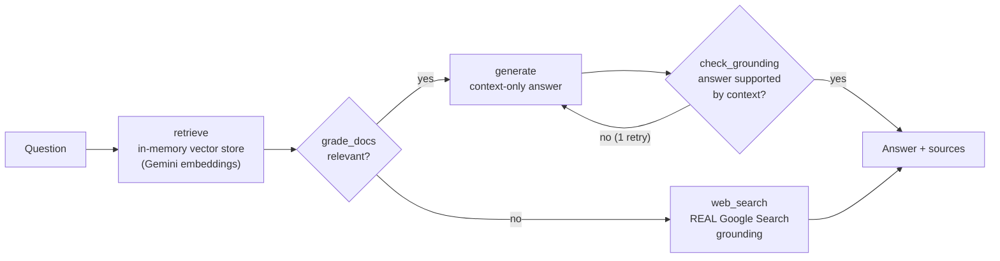

# Self-RAG Document Assistant

**Agentic RAG that grades its own retrieval, checks its own answers, and proves its lift over naive RAG with a runnable eval harness.**

   

Naive RAG has two failure modes: it answers from irrelevant context, and it fabricates when context is missing. This project implements a **Self-RAG state machine** (LangGraph) that defends against both — and ships the evaluation that demonstrates it, because an AI feature without evals is a vibe.

## Architecture



Five nodes, each one real:

- **grade_docs** — a fast LLM grades every retrieved chunk's relevance via strict JSON; irrelevant context never reaches generation
- **web_search** — when nothing relevant survives grading, the fallback uses the Gemini `google_search` tool: the model actually searches, it doesn't pretend to
- **check_grounding** — after generation, a judge verifies every claim is supported by the context; an ungrounded answer gets one stricter regeneration, then is *flagged in the response* rather than silently returned

## Evaluation — run it, don't trust it

`scripts/evaluate.py` runs **Naive RAG and Self-RAG on identical questions with identical scoring**:

| metric | what it measures |
|---|---|
| answer accuracy | answerable questions: does the answer contain the expected facts? |
| honesty | unanswerable questions: does the pipeline avoid fabricating? |

```bash
GEMINI_API_KEY=... python scripts/evaluate.py
```

> Results table: run the command above and paste your output here. This README intentionally contains no numbers the script in this repo didn't produce.

The honesty metric is where Self-RAG earns its complexity: naive RAG, handed irrelevant context and an unanswerable question, tends to improvise; Self-RAG routes to grounded web search or says what's missing.

## Visual demo

The app serves a single-page visualizer at `/` that animates the Self-RAG state
machine as your question flows through it: nodes light up in sequence, the
`grade_docs` decision shows whether retrieved context was relevant, and the
answer is tagged with the path it took (`via documents` vs `via web search`)
and whether grounding was verified. Run the server and open http://localhost:8000.

## Run it

One free API key (https://ai.google.dev), no cloud project, no vector database to provision:

```bash
pip install -r requirements.txt
export GEMINI_API_KEY=your-key

uvicorn src.main:app --reload        # ingests ./docs on startup
```

Then open **http://localhost:8000/** — the built-in visualizer shows every
answer's path through the state machine: which nodes ran, what the grader
decided, whether the grounding check passed, and when the pipeline fell back
to grounded web search. Ask the sample question *"What was Helix's Q1 2019
revenue?"* (not in the docs) and watch the route change.

Or hit the API directly:

```bash
curl -X POST localhost:8000/ask -H "Content-Type: application/json" \
     -d '{"question": "What was Q3 2025 revenue?"}'
```

Response shape — sources and self-assessment included:

```json
{
  "answer": "Q3 2025 revenue reached $4.2M...",
  "sources": ["financial_report_q3.md"],
  "used_web_fallback": false,
  "grounded": true,
  "provider": "gemini",
  "trace": [
    {"node": "retrieve", "detail": "4 chunks from 3 documents"},
    {"node": "grade_docs", "detail": "2/4 chunks judged relevant"},
    {"node": "generate", "detail": "first attempt"},
    {"node": "check_grounding", "detail": "answer supported by context"}
  ]
}
```

Every response carries its own execution trace — the UI renders it, and it
doubles as observability for free.

Drop your own `.md`/`.txt` files into `docs/` and restart — three sample enterprise documents (financial report, HR policy, production-line spec) are included so it works out of the box.

```bash
FAKE_LLM=1 python -m pytest tests/   # full suite, no network, no key
```

## Deploy to production

**One-click deploy to Vercel** (free tier, ~2 minutes):

[](https://vercel.com/new/clone?repository-url=https://github.com/ShrinikaTelu/Enterprise-Document-Assistant)

1. Click the button above or go to https://vercel.com/new
2. Import the `ShrinikaTelu/Enterprise-Document-Assistant` repository
3. Add environment variable: `GEMINI_API_KEY` (get yours at https://ai.google.dev)
4. Deploy - your live URL appears in ~60 seconds

**Alternative platforms** (render.yaml, railway.toml, and Procfile included):
- **Render:** https://render.com (auto-detects `render.yaml`)
- **Railway:** https://railway.app (auto-detects `railway.toml`)

All three platforms offer free tiers suitable for demos and portfolio projects.

## Design decisions

- **In-memory numpy vector store, on purpose.** At document-assistant scale (hundreds of chunks), exact cosine search is simpler, free, and instant. The store and the LLM provider are both small interfaces — an enterprise deployment swaps in Vertex AI Vector Search and Vertex-hosted models without touching the graph. The previous iteration of this repo required a provisioned GCP Vector Search index just to start; this one runs in 30 seconds.
- **`FakeProvider` powers the test suite** — deterministic embeddings and templated completions exercise every graph route (generate path, fallback path, API contract) with zero network. CI never needs a secret.
- **The grounding check can fail loudly.** If regeneration doesn't fix an unsupported answer, `"grounded": false` ships in the response. Callers get honesty, not confidence theater.

## Stack

LangGraph · FastAPI · Gemini API (REST, grounded search) · numpy · pytest · zero-build vanilla-JS visualizer

---

Built by [Shrinika Telu](https://shrinikatelu.github.io/) — [LinkedIn](https://www.linkedin.com/in/shrinikatelu/)
