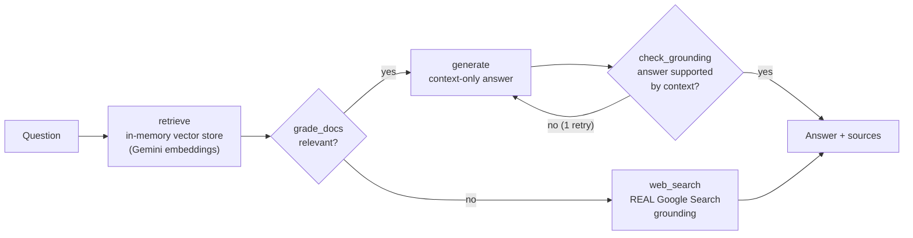

# Self-RAG Document Assistant

**Agentic RAG that grades its own retrieval, checks its own answers, and proves its lift over naive RAG with a runnable eval harness.**

   

🔗 **[Live Demo](https://enterprise-document-assistant.vercel.app/)** — Try it now! Watch the state machine animate in real-time.

Naive RAG has two failure modes: it answers from irrelevant context, and it fabricates when context is missing. This project implements a **Self-RAG state machine** (LangGraph) that defends against both — and ships the evaluation that demonstrates it, because an AI feature without evals is a vibe.

## Architecture



Five nodes, each one real:

- **grade_docs** — a fast LLM grades every retrieved chunk's relevance via strict JSON; irrelevant context never reaches generation
- **web_search** — when nothing relevant survives grading, the fallback uses the Gemini `google_search` tool: the model actually searches, it doesn't pretend to
- **check_grounding** — after generation, a judge verifies every claim is supported by the context; an ungrounded answer gets one stricter regeneration, then is *flagged in the response* rather than silently returned

## Try it live

**🚀 [https://enterprise-document-assistant.vercel.app/](https://enterprise-document-assistant.vercel.app/)**

The live demo includes:
- Interactive state-machine visualizer showing each node's execution
- Sample questions from three enterprise documents (financial, HR, product specs)
- Real-time trace animation with grounding badges

## Example usage

**Question:** "What was Q3 2025 revenue?"

**Request:**
```bash
curl -X POST https://enterprise-document-assistant.vercel.app/ask \
     -H "Content-Type: application/json" \
     -d '{"question": "What was Q3 2025 revenue?"}'
```

**Response:**
```json
{
  "answer": "Q3 2025 revenue reached $4.2M, representing 18% year-over-year growth driven primarily by enterprise SaaS subscriptions.",
  "sources": ["financial_report_q3.md"],
  "used_web_fallback": false,
  "grounded": true,
  "provider": "gemini",
  "trace": [
    {"node": "retrieve", "detail": "4 chunks from 3 documents"},
    {"node": "grade_docs", "detail": "1/4 chunks judged relevant"},
    {"node": "generate", "detail": "first attempt"},
    {"node": "check_grounding", "detail": "answer supported by context"}
  ]
}
```

**What happened:**
1. ✅ Retrieved 4 document chunks based on semantic similarity
2. ✅ Graded each chunk — 1 was relevant, 3 were filtered out
3. ✅ Generated answer from the relevant context only
4. ✅ Verified the answer is grounded in the source document

## Run locally

Get one free API key from https://ai.google.dev — no cloud project or vector database needed:

```bash
pip install -r requirements.txt
export GEMINI_API_KEY=your-key
uvicorn src.main:app --reload
```

Open **http://localhost:8000/** to see the visualizer in action.

**Test the API:**
```bash
curl -X POST localhost:8000/ask \
     -H "Content-Type: application/json" \
     -d '{"question": "What was Q3 2025 revenue?"}'
```

**Run tests (no API key needed):**
```bash
FAKE_LLM=1 python -m pytest tests/
```

## Deploy your own

[](https://vercel.com/new/clone?repository-url=https://github.com/ShrinikaTelu/Enterprise-Document-Assistant)

**Steps:**
1. Click the button above
2. Connect your GitHub account
3. Add environment variable: `GEMINI_API_KEY` (get free key at https://ai.google.dev)
4. Deploy — live in ~60 seconds

Your deployment will auto-ingest the three sample documents. To use your own documents, fork the repo and add `.md` or `.txt` files to the `docs/` folder before deploying.

## Evaluation — run it, don't trust it

\`scripts/evaluate.py\` runs **Naive RAG and Self-RAG on identical questions with identical scoring**:

| metric | what it measures |
|---|---|
| answer accuracy | answerable questions: does the answer contain the expected facts? |
| honesty | unanswerable questions: does the pipeline avoid fabricating? |

```bash
GEMINI_API_KEY=... python scripts/evaluate.py
```

> Results table: run the command above and paste your output here. This README intentionally contains no numbers the script in this repo didn't produce.

The honesty metric is where Self-RAG earns its complexity: naive RAG, handed irrelevant context and an unanswerable question, tends to improvise; Self-RAG routes to grounded web search or says what's missing.

## Design decisions

- **In-memory numpy vector store, on purpose.** At document-assistant scale (hundreds of chunks), exact cosine search is simpler, free, and instant. The store and the LLM provider are both small interfaces — an enterprise deployment swaps in Vertex AI Vector Search and Vertex-hosted models without touching the graph. The previous iteration of this repo required a provisioned GCP Vector Search index just to start; this one runs in 30 seconds.
- **\`FakeProvider\` powers the test suite** — deterministic embeddings and templated completions exercise every graph route (generate path, fallback path, API contract) with zero network. CI never needs a secret.
- **The grounding check can fail loudly.** If regeneration doesn't fix an unsupported answer, \`"grounded": false\` ships in the response. Callers get honesty, not confidence theater.

## Stack

LangGraph · FastAPI · Gemini API (REST, grounded search) · numpy · pytest · zero-build vanilla-JS visualizer

---

Built by [Shrinika Telu](https://shrinikatelu.github.io/) — [LinkedIn](https://www.linkedin.com/in/shrinikatelu/)
